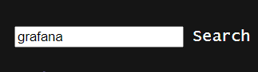
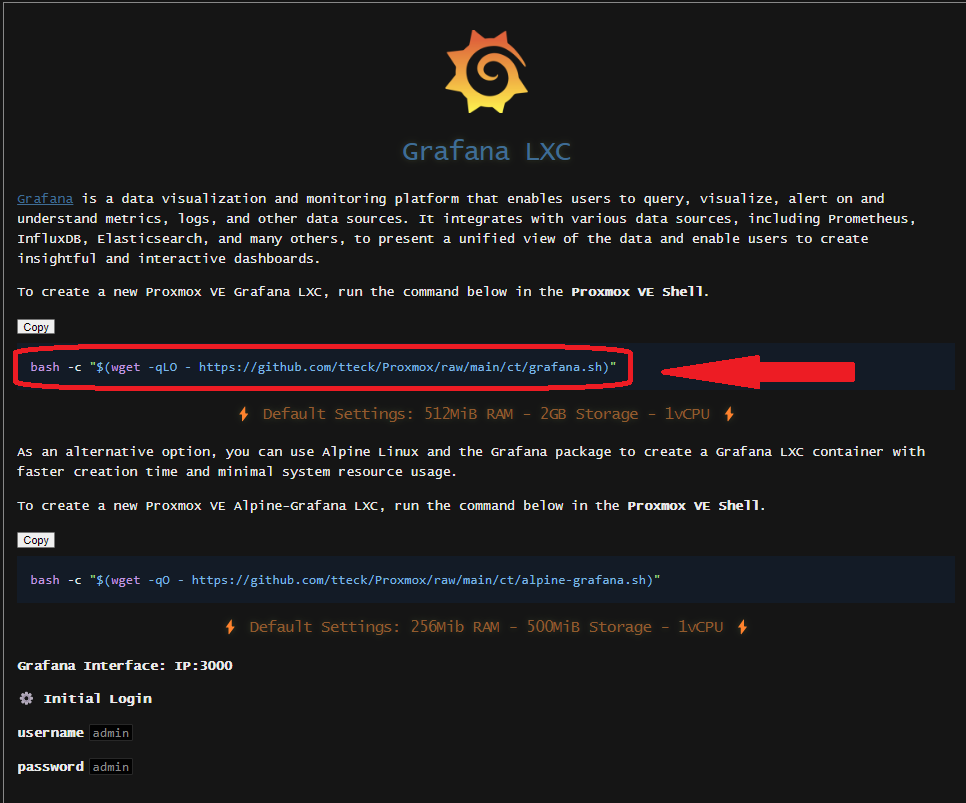
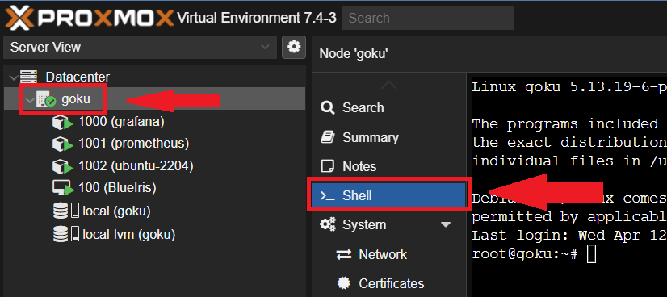

## Que es grafana?

Es un programa para poder visualizar graficamente (por medio de graficas) cualquier tipo de datos numericos. O sea, si queremos ver el porcentaje de uso del procesador de una maquina virtual o fisica, esa es una de las cosas que se puede usar.

Lo bueno de grafana es que la pagina se puede poner para que se refresque cada 5 segundos, eso significa que las graficas que uno ve, son casi instantaneas, de lo que esta sucediendo en ese momento!

Pero grafana no hace todo solo, este programa se dedica a la parte de visualizacion solamente. Todos los datos tienen que ser colectados y guardados por otros programas, como puede ser Prometheus o InfluxDB, entre otros. Yo solo tengo experiencia usando estos dos que nombre anteriormente. 

Yo en mis servidores uso Prometheus para monitorear los servidores e InfluxDB para monitorear todo lo que sea al respecto de Home Assistant.

Bueno, ahora que tenmos una idea de que es Grafana, vamos a instalarla y configurarla!

## Instalando Grafana Container

Hay muchas maneras de instalar grafana, yo decidi tener el programa en un contenedor de Proxmox, de esta manera con uso una maquina Virtual solo para este programa que es liviano.

Gracias a [tteck](https://tteck.github.io/Proxmox/) por crear todos estos scripts que hacen la instalacion de las aplicacions mas rapidas y facil de hacer, es que pude instalar Grafana y otros programas.

Vallan a la pagina de [tteck](https://tteck.github.io/Proxmox/) y en el buscador pongan grafana

Les va a aparecer lo siguiente, donde van a poder ver 2 comandos distintos, dependiendo de la potencia que tenga el Proxmox que estan usando, es cual deben de usar. Yo use el primero, el que esta encuadrado en rojo, apreten arriba de donde dice "Copy" para copiar el comando completo, o seleccionenlo todo y copienlo.

Ahora vallan a Proxmox, seleccionen su servidor, y seleccionen arriba de ">_ Shell"

En la terminal que les aparecio al costado, peguen el comando, apreten el boton derecho del mouse y apreten en pegar, les va a quedar asi:

